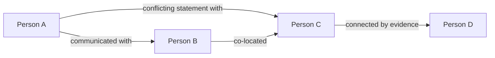
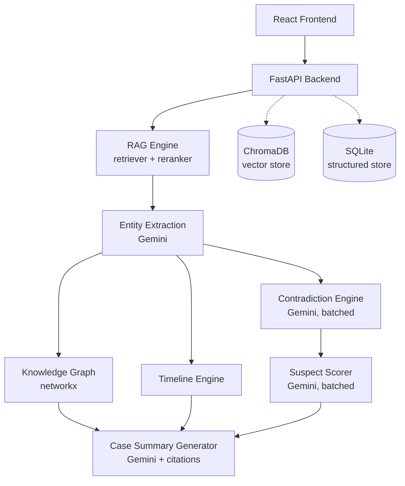

#  DetectiveRAG

**An AI-powered investigative intelligence platform that reconstructs criminal cases from raw case files using Retrieval-Augmented Generation, knowledge-graph reasoning, and evidence-grounded LLM analysis.**

DetectiveRAG ingests unstructured case documents — police reports, CCTV transcripts, forensic reports, witness statements, phone records — and turns them into a queryable investigation workstation. It answers investigator questions with cited evidence, reconstructs a chronological timeline of events, flags contradictory statements, scores suspects, and produces a final case-closure report.

> Built as a full-stack, end-to-end RAG systems project: FastAPI + ChromaDB + SQLite on the backend, React + TypeScript on the frontend, Google Gemini as the reasoning layer.

---

## Table of Contents

- [Project Analysis](#project-analysis)
- [Core Features](#core-features)
- [The RAG Pipeline](#the-rag-pipeline)
- [Embedding Model](#embedding-model)
- [Vector Database — ChromaDB](#vector-database--chromadb)
- [Knowledge Graph](#knowledge-graph)
- [Timeline Reconstruction Engine](#timeline-reconstruction-engine)
- [Contradiction Detection Engine](#contradiction-detection-engine)
- [Suspect Scoring Engine](#suspect-scoring-engine)
- [Case Summary Generation](#case-summary-generation)
- [System Architecture](#system-architecture)
- [Tech Stack](#tech-stack)
- [Database Design](#database-design)
- [API Surface](#api-surface)
- [Project Structure](#project-structure)
- [Challenges Faced](#challenges-faced)
- [Future Improvements](#future-improvements)

---

## Project Analysis

This section documents what was actually verified by inspecting the source code, so the rest of the README reflects the real implementation rather than an assumed one.

| Component | Implementation |
|---|---|
| **Embedding model** | `sentence-transformers/all-MiniLM-L6-v2` (384-dim), loaded as a local singleton |
| **Vector database** | ChromaDB `PersistentClient`, one collection per case, `hnsw:space="cosine"` |
| **Chunking strategy** | LangChain `RecursiveCharacterTextSplitter`, 1500-char chunks, 300-char overlap |
| **Retrieval strategy** | Embed query → cosine similarity search in Chroma → top-k (default k=8) candidates |
| **Reranker** | Heuristic reranker (not a neural cross-encoder): `0.7 × cosine similarity + 0.2 × doc-type relevance + 0.1 × keyword overlap`, with Jaccard-based near-duplicate suppression |
| **LLM** | Google Gemini (`gemini-2.5-flash` by default) via `google-generativeai` |
| **Knowledge graph** | `networkx` graph built from entity co-mentions across documents, exported in React Flow node/edge format |
| **Timeline engine** | Rule-based time-string normalization (`dateutil` + regex) anchored to the case date, deduplicated and sorted chronologically |
| **Contradiction engine** | Rule-based candidate prefilter (same person, different documents, time/location claims) verified by a **single batched** Gemini call |
| **Suspect scoring** | Weighted formula over four sub-scores: `30% opportunity + 25% motive + 25% contradictions + 20% evidence strength`, with motive scored by a single batched LLM call |
| **Summary generation** | Retrieval + rerank + Gemini synthesis with inline `[S#]` citations, plus a deterministic fallback report for quota-exhausted requests |
| **Frontend stack** | React 18, TypeScript, Vite, Tailwind CSS, Zustand, React Flow, Recharts, dnd-kit, Framer Motion, TanStack Query |
| **Backend stack** | FastAPI, Python, SQLite (via `aiosqlite`), ChromaDB, PyMuPDF, python-docx |

---

## Core Features

- **Investigator Terminal** — natural-language chat over the case file, every answer grounded in cited source excerpts.
- **Evidence Viewer** — browse parsed documents, extracted chunks, and metadata by document type.
- **Timeline Reconstruction** — chronological event list built from extracted time references, cross-referenced against known contradictions.
- **Contradiction Detection** — flags cases where a person's statement conflicts with independent evidence (e.g. CCTV, badge logs).
- **Suspect Scoring** — ranks persons of interest by a transparent, weighted suspicion score.
- **Case Closure Report** — a synthesized, cited narrative verdict generated from the full evidence base.

---

## The RAG Pipeline

```
Document Upload
      ↓
Document Parsing        (PyMuPDF for PDF, python-docx for DOCX, plain read for TXT)
      ↓
Text Cleaning            (header/footer stripping, ligature fixes, whitespace normalization)
      ↓
Chunking                  (RecursiveCharacterTextSplitter — 1500 chars / 300 overlap)
      ↓
Embedding Generation      (all-MiniLM-L6-v2 → 384-dim vectors)
      ↓
Vector Storage            (ChromaDB, one cosine-space collection per case)
      ↓
Entity Extraction         (Gemini, structured JSON — people, times, locations, objects, claims)
      ↓
Knowledge Graph Creation (networkx, entity co-mention graph)
      ↓
Retrieval                 (query embedding → cosine top-k from Chroma)
      ↓
Reranking                 (heuristic: cosine + doc-type relevance + keyword overlap, dedup)
      ↓
Prompt Construction       ([S#]-tagged source blocks + conversation history)
      ↓
Gemini Reasoning          (gemini-2.5-flash, temperature 0.1–0.2)
      ↓
Grounded Response + Citations (citation_engine maps [S#] → source metadata)
```

**Document Upload & Parsing.** Uploaded PDFs are parsed page-by-page with PyMuPDF; DOCX files are parsed paragraph-by-paragraph (including tables) with `python-docx`; TXT files are read directly. The document type (`police_report`, `cctv_transcript`, `forensic_report`, `witness_statement`, etc.) is inferred from filename patterns and stored as chunk metadata, which later drives reranking and knowledge-graph relationship labeling.

**Text Cleaning.** Before chunking, the cleaner detects lines repeated across more than half a document's pages (running headers/footers) and strips them, removes page-number-only lines, fixes PDF ligature artifacts (`fi`, `fl`, etc.), and normalizes smart quotes and dashes.

**Chunking.** Cleaned page text is split with LangChain's `RecursiveCharacterTextSplitter` using a separator cascade (`\n\n`, `\n`, `. `, ` `, `""`), 1500-character chunks with 300-character overlap, preserving character offsets and page numbers for citation.

**Embedding & Vector Storage.** Each chunk is embedded with a local `all-MiniLM-L6-v2` model and stored in a per-case ChromaDB collection alongside its text and metadata (filename, doc type, page, chunk index).

**Entity Extraction & Knowledge Graph.** A single Gemini call per document extracts structured entities (people, times, locations, objects, and person/time/location/action "claims") as JSON, which are persisted to SQLite and later used to build the knowledge graph, timeline, and contradiction/suspect analyses.

**Retrieval & Reranking.** A user question is embedded and matched against the case's Chroma collection via cosine similarity. The heuristic reranker then re-scores the candidates using a weighted blend of similarity, document-type relevance to the inferred query type (time/location/forensic/motive/alibi), and keyword overlap, discarding near-duplicate chunks (character-trigram Jaccard similarity > 0.85).

**Prompt Construction & Reasoning.** The top reranked chunks are formatted into numbered `[S1]…[Sn]` source blocks along with recent chat history, and sent to Gemini under a system prompt instructing it to answer only from the provided excerpts, cite every claim, and flag conflicting sources explicitly.

**Grounded Response.** The citation engine parses `[S#]` tags out of the model's response and maps each one back to its originating chunk (document, page, snippet, similarity-derived confidence) for the frontend to render as inline citations.

---

## Embedding Model

DetectiveRAG uses **`sentence-transformers/all-MiniLM-L6-v2`**, run locally (no external embedding API call) and lazily loaded once as a process-wide singleton.

- **Dimensionality:** 384
- **Why this model fits the use case:** it's a compact, CPU-friendly sentence embedding model — appropriate for a self-contained investigative tool where documents are batch-embedded on upload and queries need to embed near-instantly without depending on an external embeddings API.
- **Chunk embedding:** all chunk texts for a document are embedded in batches of 32.
- **Query embedding:** the investigator's question is embedded with the same model (`embed_single`) to guarantee the query and corpus live in the same vector space.
- **Similarity retrieval:** ChromaDB performs the nearest-neighbor search internally using cosine distance; the retriever converts Chroma's cosine distance (0 = identical, 2 = opposite) into a normalized similarity score (`1 - distance/2`) for downstream reranking and citation confidence.

---

## Vector Database — ChromaDB

DetectiveRAG stores all chunk embeddings in **ChromaDB**, run as an embedded `PersistentClient` (no separate server process to operate).

- **Why ChromaDB:** it gives persistent, file-backed vector storage with metadata filtering out of the box, with no infrastructure to stand up — a good fit for a project that runs case-by-case, potentially offline.
- **Indexing model:** each case gets its **own collection** (`case_<case_id>`), so cases are fully isolated from one another and can be deleted independently.
- **Index configuration:** every collection is created with `hnsw:space="cosine"`, so similarity search uses cosine distance over the 384-dim MiniLM vectors.
- **Chunk & metadata storage:** each chunk is added with its id, embedding, raw text, and metadata (`doc_id`, `filename`, `doc_type`, `page`, `chunk_index`); additions are batched in groups of 500.
- **Retrieval strategy:** queries embed the question, then call `collection.query(...)` for the top-k nearest chunks (k is automatically capped to the collection's current size so small cases don't error out), returning documents, metadata, and distances together.
- **Role in the pipeline:** ChromaDB is the sole semantic memory of the system — everything structural (entities, contradictions, timeline, suspects) lives in SQLite, but *unstructured evidence text* is only ever found again through Chroma.

---

## Knowledge Graph

The knowledge graph is built with **networkx** from the entities already stored in SQLite — it is not queried live during chat, but computed on demand for the suspect graph view.

- **Entity extraction:** performed upstream by Gemini per document (people, times, locations, objects, claims) and persisted to the `entities` table.
- **Relationship extraction:** relationships aren't separately extracted by the LLM — instead, any two people who appear as `person` entities in the *same document* are connected, with the edge's relation label derived from that document's type (e.g. a `phone_record` produces a "communicated with" edge, a `cctv_transcript` produces an "observed with" edge).
- **Graph construction:** nodes are unique people (annotated with their computed suspicion score and role, once suspect scoring has run); edges accumulate a weight and a list of relation types as more shared documents are found.
- **Contradiction linking:** for every stored contradiction, the engine scans both conflicting claim texts for known person names and adds (or upgrades) an edge labeled "conflicting statement with" between them — this takes priority when rendering an edge's label if multiple relation types apply.
- **Graph traversal / export:** the final `networkx.Graph` is flattened into a React Flow–compatible `{nodes, edges}` structure (the frontend, not networkx, computes the visual layout).



---

## Timeline Reconstruction Engine

- **Temporal entity extraction:** raw time expressions are captured during entity extraction (e.g. "around 7:45 PM", "quarter past eight") and stored per document with surrounding context.
- **Event normalization:** `normalize_time` strips hedge words ("around", "approximately"), expands colloquial forms ("quarter past 8" → `8:15`, "half past 7" → `7:30`), and falls back to `dateutil.parser` anchored to a fixed case date, with a final regex fallback for bare `HH:MM am/pm` patterns.
- **Event sorting:** normalized `HH:MM` values are converted to minutes-since-midnight for chronological sorting; unparseable timestamps sort to the end rather than breaking the pipeline.
- **Chronology reconstruction:** event descriptions are cleaned up from the stored claim context (stripping the `time=`/`loc=`/`action=` markers used internally) and deduplicated using word-overlap similarity (>0.7 is treated as a duplicate).
- **Contradiction highlighting:** any timeline event sourced from a document that's party to a stored contradiction is flagged `is_contradicted`, so the frontend can visually surface disputed events on the timeline.

> Note: the case date used for anchoring relative time parsing is currently a fixed constant tied to the bundled sample case (the Riverside Museum Murder, March 15). This is a known simplification worth generalizing for multi-case, arbitrary-date use — see [Future Improvements](#future-improvements).

---

## Contradiction Detection Engine

A **hybrid rule-based + LLM** design, purpose-built to minimize Gemini API calls:

1. **Claim extraction** — already available from entity extraction; every `claim` entity ties a person to a time/location/action.
2. **Candidate pairing (rule-based, free)** — for every person with 2+ claims from *different* documents, candidate pairs are formed only if at least one claim on each side references a time or a location (filtering out pairs with nothing comparable).
3. **Verification (LLM, batched)** — all candidate pairs (capped at 20 per case to bound cost) are sent to Gemini in a **single batched JSON call**, rather than one call per pair, asking it to judge each pair's `conflict` status and produce an `explanation`.
4. **Scoring & storage** — pairs the model marks as conflicting are persisted with both claim texts, their source documents, and the model's explanation.

**Worked example (from the bundled sample case):**

> Marcus Bellweather claimed to leave the museum at approximately 7:45 PM, but CCTV footage placed him inside the museum at 8:17 PM.

This is exactly the kind of time-and-location conflict the candidate prefilter is designed to surface before a single LLM call confirms it as a genuine contradiction.

---

## Suspect Scoring Engine

Each identified person (excluding the victim, matched by name) receives four sub-scores that combine into a total suspicion score:

```
Suspicion Score =
    0.30 × Opportunity +
    0.25 × Motive +
    0.25 × Contradictions +
    0.20 × Evidence Strength
```

- **Opportunity** — derived from the share of that person's timeline events *not* corroborated by alibi-type language ("alibi", "confirmed", "receipt", "restaurant", "dinner"); the more unaccounted-for time windows, the higher the score.
- **Motive** — scored by Gemini (0–100) from relevant retrieved evidence text about that person, computed for *all* suspects in a **single batched LLM call**; defaults to a neutral 30 if no relevant text is retrieved.
- **Contradictions** — `min(100, contradiction_count × 20)`, based on how many stored contradictions mention that person.
- **Evidence Strength** — `min(100, forensic_document_count × 25)`, counting how many of that person's associated documents are forensic/technical evidence types (forensic report, autopsy, CCTV, security log, evidence inventory, phone record).

Name handling includes normalizing "Last, First" forms and merging surname-only mentions into the fuller name they belong to (so "Bellweather" folds into "Marcus Bellweather" rather than appearing as a separate suspect).

---

## Case Summary Generation

The case closure report reuses the same retrieval → rerank → prompt → citation pipeline as chat, with a case-specific synthesis prompt asking Gemini to produce a verdict, a confidence percentage, and a structured evidentiary narrative referencing sources.

To keep the demo resilient to Gemini quota limits, the summary router also ships a **deterministic fallback report** (hand-written, not LLM-generated) for the bundled sample case, returned automatically if the live Gemini call fails with a quota error — so the "case closure" experience is never blocked by rate limits.

---

## System Architecture



---

## Tech Stack

**Frontend**
- React 18 + TypeScript
- Vite
- Tailwind CSS
- Zustand (state management)
- React Flow (`reactflow`, knowledge-graph visualization)
- Recharts (suspect score charts)
- TanStack Query
- dnd-kit, Framer Motion

**Backend**
- FastAPI
- Python
- SQLite (via `aiosqlite`)
- ChromaDB

**AI/ML**
- Google Gemini (`google-generativeai`, `gemini-2.5-flash` default)
- Sentence Transformers (`all-MiniLM-L6-v2`)
- LangChain text splitters (chunking only)
- RAG: retrieval, heuristic reranking, citation grounding
- networkx (knowledge graph)

---

## Database Design

DetectiveRAG uses **SQLite** for all structured data and **ChromaDB** exclusively for chunk vectors.

| Table | Purpose |
|---|---|
| `cases` | Case metadata: id, name, creation time, status |
| `documents` | One row per uploaded file: filename, inferred `doc_type`, page count, chunk count |
| `chunks` | Chunked text with page number and character offsets (citation source of truth) |
| `entities` | Every extracted person / time / location / object / claim, tied to its source document |
| `contradictions` | Confirmed conflicting claim pairs with source doc ids and an LLM-generated explanation |
| `timeline_events` | Normalized, deduplicated, sorted chronological events, flagged if contradicted |
| `suspects` | Per-case suspect scorecards: role, opportunity/motive/evidence scores, contradiction count, total score, motive summary |

---

## API Surface

| Method | Route | Purpose |
|---|---|---|
| `GET` | `/health` | Service health check |
| `POST` | `/upload` | Upload and ingest a case document |
| `GET` | `/documents/{case_id}` | List documents for a case |
| `GET` | `/documents/status/{case_id}` | Ingestion/processing status |
| `GET` | `/documents/{case_id}/{doc_id}` | Fetch a single document's detail |
| `POST` | `/chat` | Ask an investigative question (RAG + citations) |
| `GET` | `/timeline/{case_id}` | Retrieve the reconstructed timeline |
| `GET` | `/contradictions/{case_id}` | Retrieve confirmed contradictions |
| `GET` | `/suspects/{case_id}` | Retrieve suspect scorecards |
| `GET` | `/suspects/{case_id}/graph` | Retrieve the knowledge graph (React Flow format) |
| `GET` | `/summary/{case_id}` | Retrieve the generated case closure report |

---

## Project Structure

```
detective-rag/
├── backend/
│   ├── app/
│   │   ├── main.py                     # FastAPI app, router registration, CORS, DB init
│   │   ├── config.py                   # Settings (env-driven paths, API key, CORS)
│   │   ├── models/
│   │   │   ├── db_models.py            # SQLite schema (CREATE TABLE statements)
│   │   │   └── schemas.py              # Pydantic request/response models
│   │   ├── repositories/
│   │   │   ├── chroma_repo.py          # ChromaDB client, collection, add/query/delete
│   │   │   └── sqlite_repo.py          # SQLite CRUD for all structured tables
│   │   ├── routers/
│   │   │   ├── health.py
│   │   │   ├── upload.py
│   │   │   ├── documents.py
│   │   │   ├── chat.py
│   │   │   ├── timeline.py
│   │   │   ├── contradictions.py
│   │   │   ├── suspects.py
│   │   │   └── summary.py
│   │   ├── services/
│   │   │   ├── document_parser.py      # PDF/DOCX/TXT parsing, doc-type inference
│   │   │   ├── text_cleaner.py         # Header/footer stripping, normalization
│   │   │   ├── chunker.py              # RecursiveCharacterTextSplitter wrapper
│   │   │   ├── embedder.py             # all-MiniLM-L6-v2 embedding
│   │   │   ├── retriever.py            # Query embedding + Chroma search
│   │   │   ├── reranker.py             # Heuristic weighted reranking
│   │   │   ├── entity_extractor.py     # LLM-assisted structured entity extraction
│   │   │   ├── graph_builder.py        # networkx knowledge graph construction
│   │   │   ├── timeline_engine.py      # Time normalization + chronology
│   │   │   ├── contradiction_engine.py # Rule-based prefilter + batched LLM verification
│   │   │   ├── suspect_scorer.py       # Weighted suspicion scoring
│   │   │   ├── prompt_builder.py       # All LLM prompt templates
│   │   │   ├── citation_engine.py      # [S#] → source metadata mapping
│   │   │   └── llm_client.py           # Gemini wrapper, JSON extraction, quota handling
│   │   └── utils/
│   │       ├── ids.py
│   │       └── logging.py
│   ├── sample_case/
│   │   └── riverside_museum_murder/    # Bundled demo case (14 source documents)
│   ├── seed_case.py                    # Seeds the sample case into the system
│   ├── requirements.txt
│   └── data/                           # Raw uploads, processed cache, Chroma persistence, SQLite file
│
├── frontend/
│   ├── src/
│   │   ├── components/
│   │   │   ├── chat/                   # Investigator terminal
│   │   │   ├── evidence/               # Evidence viewer
│   │   │   ├── timeline/               # Timeline reconstruction view
│   │   │   ├── suspects/               # Suspect board + graph
│   │   │   ├── summary/                # Case closure report view
│   │   │   ├── upload/                 # Document upload flow
│   │   │   ├── layout/
│   │   │   └── ui/
│   │   ├── pages/
│   │   ├── store/                      # Zustand stores
│   │   ├── hooks/
│   │   └── lib/
│   ├── package.json
│   └── vite.config.ts
│
└── assets/screenshots/
```

---

## Challenges Faced

- **JSON truncation from the LLM** — long entity/contradiction/motive responses occasionally got cut off or wrapped in markdown fences; addressed with a balanced-bracket JSON extractor and a one-shot retry with a stricter "JSON only" instruction.
- **Gemini quota limits** — repeated per-entity or per-pair LLM calls burned through quota quickly; contradiction detection and motive scoring were redesigned around **single batched calls** covering every candidate/suspect at once, and a `QuotaExceededError` with a deterministic fallback summary keeps the demo usable when quota is exhausted.
- **Entity extraction failures** — inconsistent LLM field types (missing fields, non-string values) required defensive coercion (`_s()` helper) before persisting entities.
- **Contradiction detection false positives/negatives** — naive pairing produced too many irrelevant candidates; a rule-based prefilter (matching person + requiring a time or location reference on both sides) narrows the field before spending an LLM call.
- **Suspect deduplication** — surname-only mentions ("Bellweather") were initially scored as separate suspects from full-name mentions ("Marcus Bellweather"); resolved with a name-variant merge step that folds subset-name matches into their fuller counterpart.
- **Timeline reconstruction bugs** — colloquial time phrases ("quarter to eight," "half past seven") and hedge words ("around," "approximately") broke naive date parsing; resolved with targeted regex normalization ahead of `dateutil` fallback parsing.
- **Resumable seeding** — parsed documents are cached to disk (`processed_data_path`) so re-seeding the sample case doesn't require re-parsing from scratch.

---

## Future Improvements

- **Local LLM support** — an option to swap Gemini for a locally hosted model for fully offline operation.
- **Graph database backend** — migrating the knowledge graph from an in-memory `networkx` computation to a persistent graph database (e.g. Neo4j) for larger, cross-case relationship queries.
- **Multi-agent investigators** — specialized agents per evidence type (forensics, testimony, digital records) collaborating on a shared case state.
- **Hybrid retrieval** — combining the current dense cosine search with sparse/keyword retrieval (BM25) for queries where exact terms matter more than semantic similarity.
- **Learned reranking model** — replacing the current heuristic reranker with a trained cross-encoder for higher-precision top-k reordering.
- **Advanced contradiction reasoning** — extending beyond time/location conflicts to numeric, causal, and multi-hop contradictions across more than two claims.
- **Configurable case date** — removing the hardcoded case-date anchor in the timeline engine so the system generalizes cleanly to arbitrary new cases.
