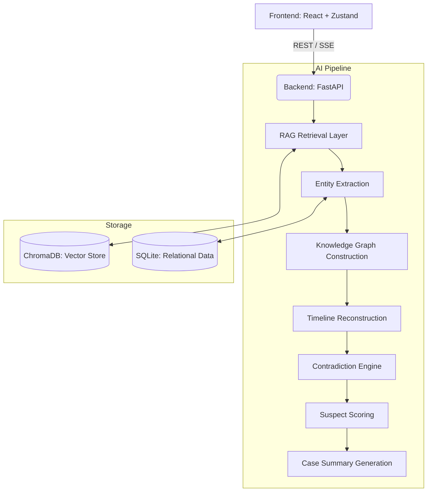

#  DetectiveRAG

An AI-powered investigative intelligence platform that reconstructs criminal cases using Retrieval-Augmented Generation (RAG), Knowledge Graph reasoning, and intelligent data analysis.

---

##  Overview

DetectiveRAG transforms raw, unstructured case files (police reports, CCTV transcripts, forensic data, witness interviews) into a coherent, queryable investigation dashboard. It acts as an AI co-detective, assisting investigators in reconstructing chronological timelines, detecting hidden contradictions in suspect statements, ranking persons of interest, and generating final case closure reports based on hard evidence.

---

##  Demo Screenshots

| Investigator Terminal (Chat) | Evidence Viewer |
| :---: | :---: |
|  |  |

| Timeline Reconstruction | Suspect Board |
| :---: | :---: |
|  |  |

| Case Closure Report |
| :---: |
|  |

*(Note: Replace placeholder image links with actual screenshots from the `assets/screenshots/` directory before publishing.)*

---

##  Major Features

- **Investigator Terminal:** A natural language chat interface that answers investigative queries using retrieved evidence. All answers are grounded with specific source citations. *(e.g., "Where was Marcus Bellweather at 8:00 PM?")*
- **Evidence Viewer:** A dedicated interface to browse and interrogate source documents, extracted segments, forensic reports, CCTV transcripts, and interview records.
- **Timeline Reconstruction:** Automatically extracts time-anchored events from across the case corpus to build a chronological reconstruction of the incident.
- **Contradiction Detection:** Cross-references witness statements against physical evidence (like CCTV or badge access logs) to identify conflicting claims. *(e.g., Suspect claims to leave at 7:45 PM, but CCTV places them inside at 8:17 PM).*
- **Suspect Scoring Engine:** Dynamically ranks suspects based on calculated scores for motive, opportunity, identified contradictions, and overall evidence strength.
- **Case Closure Report:** Automatically generates a comprehensive, detective-style investigative report synthesizing all evidence to deliver a final verdict.

---

##  Architecture

DetectiveRAG utilizes a modern, decoupled architecture with a React frontend and a FastAPI backend powering a sophisticated RAG pipeline.



---

##  Tech Stack

### Frontend
- **Framework:** React with TypeScript, Vite
- **Styling:** TailwindCSS
- **State Management:** Zustand
- **Visualization:** React Flow

### Backend & AI
- **API Framework:** FastAPI (Python)
- **Database:** SQLite (Relational), ChromaDB (Vector Search)
- **LLM Integration:** Gemini API
- **Embeddings:** Sentence Transformers
- **Core AI Modules:** RAG Pipeline, Entity Extraction, Knowledge Graph, Contradiction Engine

---

##  Installation Instructions

### Prerequisites
- Node.js (v18+)
- Python (3.10+)
- Gemini API Key

### 1. Clone the repository
```bash
git clone https://github.com/cressica18/detective-rag-1.git
cd detective-rag-1
```

### 2. Backend Setup
```bash
cd backend
python -m venv venv
source venv/bin/activate  # On Windows: venv\Scripts\activate
pip install -r requirements.txt
```

Create a `.env` file in the `backend/` directory:
```env
GEMINI_API_KEY=your_gemini_api_key_here
```

### 3. Frontend Setup
```bash
cd ../frontend
npm install
```

---

##  Running Locally

You need to run both the backend and frontend servers simultaneously.

**Start the Backend:**
```bash
cd backend
source venv/bin/activate
uvicorn app.main:app --reload --port 8000
```

**Start the Frontend:**
```bash
cd frontend
npm run dev
```

Navigate to `http://localhost:5173` in your browser to access the DetectiveRAG dashboard.

---

## 🕵 Example Investigation Workflow

1. **Upload Case Corpus:** Ingest a folder of unstructured case documents (interviews, reports, CCTV logs).
2. **AI Processing:** The backend automatically chunks documents, extracts entities, builds the knowledge graph, and indexes data into ChromaDB.
3. **Review Timeline:** Check the Timeline view for chronological event reconstruction and immediately spot red-flagged contradictions.
4. **Analyze Suspects:** Open the Suspect Board to see the AI's ranked list of persons of interest based on motive and opportunity.
5. **Interrogate:** Use the Investigator Terminal to ask specific questions about the prime suspect's alibi, reviewing the exact citations provided by the AI.
6. **Generate Summary:** Produce the final Case Closure Report detailing the verdict and evidence summary.

---

##  Challenges and Learnings

Building DetectiveRAG involved overcoming several complex engineering challenges:
- **LLM Output Stability:** Handled Gemini JSON truncation issues and null handling crashes to ensure reliable entity extraction.
- **Quota Management:** Implemented fallback generation mechanisms and resumable database seeding to gracefully handle API quota exhaustion without breaking the application state.
- **Pipeline Optimization:** Fixed suspect duplication and victim filtering bugs, and refined the timeline reconstruction engine for accurate temporal parsing.

*(Note: Certain features like contradiction detection and summary generation rely heavily on the Gemini API. If the API quota is exhausted, the application gracefully falls back to deterministic/cached data to ensure a continuous demo experience.)*

---

##  Future Improvements

- **Multi-Modal Evidence:** Add support for analyzing raw images and audio recordings (e.g., 911 calls, crime scene photos).
- **Interactive Graph Exploration:** Enhance the Knowledge Graph UI to allow deep-dive visual exploration of connections between entities.
- **Local LLM Support:** Integrate Ollama or vLLM support to run the entire pipeline locally without relying on external APIs.

---

##  Project Structure Tree

```
detective-rag/
├── backend/
│   ├── app/
│   │   ├── models/        # Pydantic & DB schemas
│   │   ├── repositories/  # SQLite & ChromaDB access
│   │   ├── routers/       # FastAPI endpoints
│   │   ├── services/      # Core AI engines & LLM client
│   │   └── utils/         # Helpers
│   ├── data/              # SQLite DB & Chroma storage
│   ├── sample_case/       # Demo case corpus
│   ├── tests/             # Unit & Integration tests
│   ├── main.py            # FastAPI entry point
│   └── seed_case.py       # DB initialization script
└── frontend/
    ├── src/
    │   ├── components/    # React components (Chat, Timeline, etc.)
    │   ├── hooks/         # Custom React hooks & API queries
    │   ├── lib/           # API clients & utilities
    │   ├── pages/         # Route views
    │   └── store/         # Zustand state management
    ├── index.html
    ├── tailwind.config.ts
    └── vite.config.ts
```

---

##  Credits

Developed as an advanced AI demonstration project showcasing applied Retrieval-Augmented Generation (RAG) and Agentic Workflows in domain-specific scenarios.

---

##  License

This project is open-source and available under the [MIT License](LICENSE).
